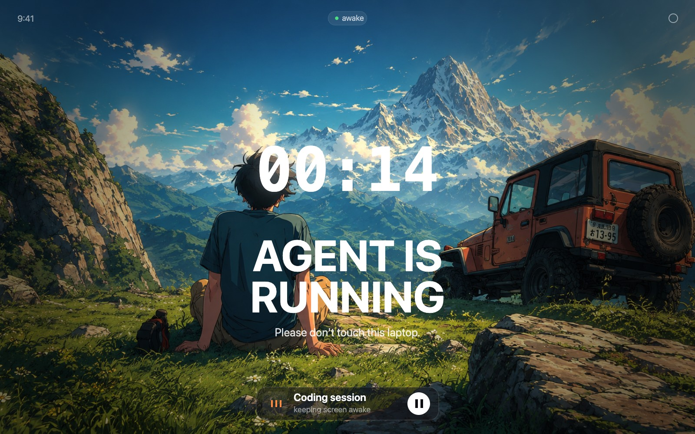
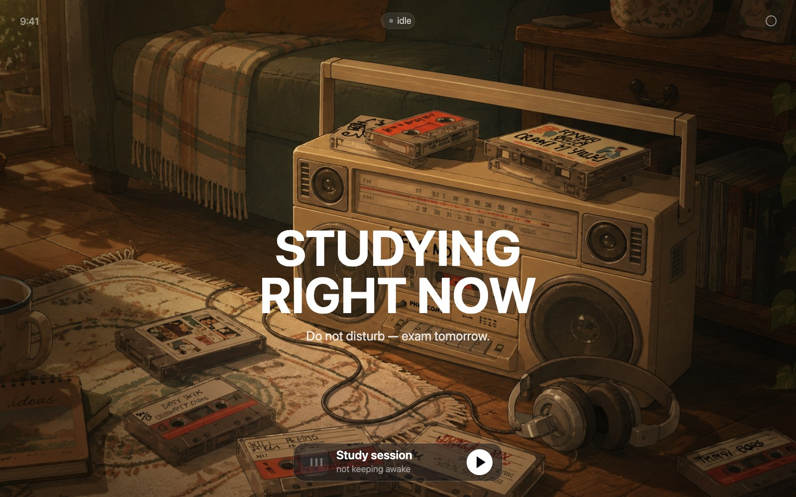
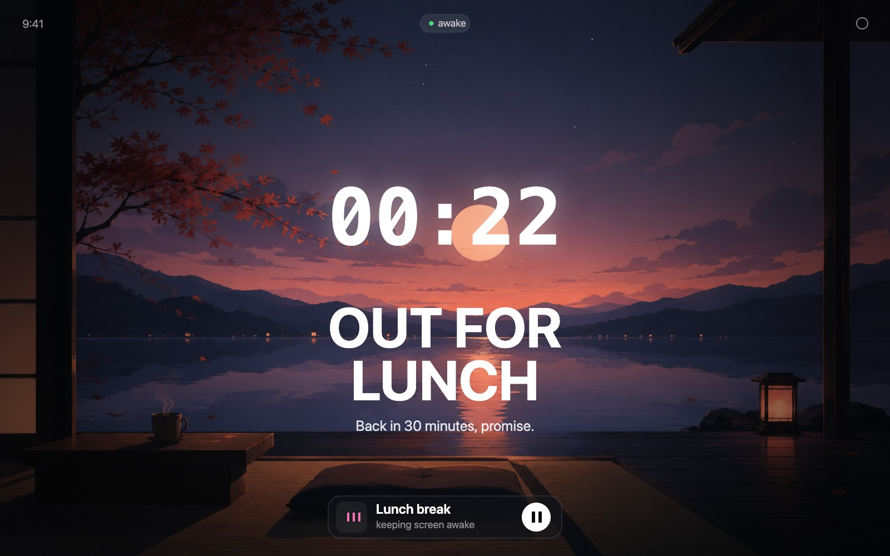
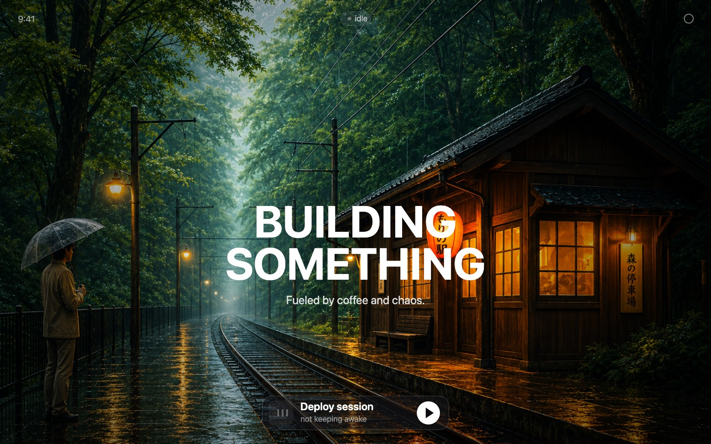
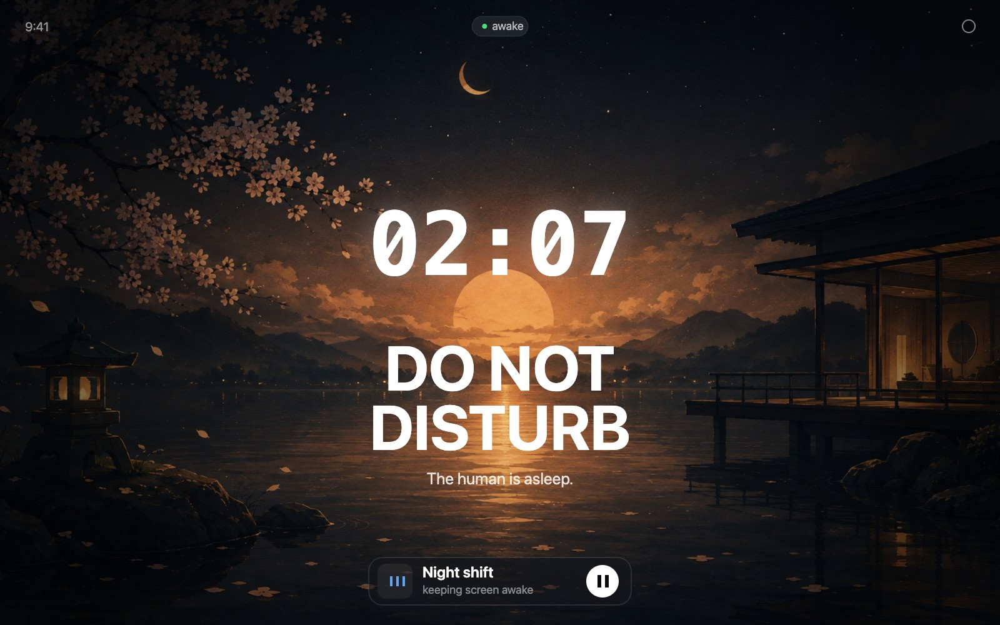
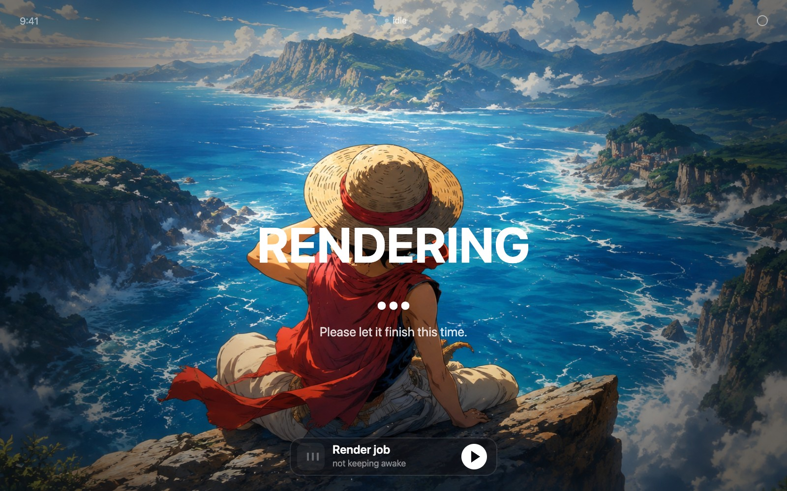

<div align="center">

# my-agent-is-running

**A tiny, slightly silly website with one job: keep your laptop screen awake, and put up a "please don't touch this" sign while you're gone.**



*That's it. That's the whole app. Built for fun, not for scale.*

</div>

<br />

## The problem it solves

Your laptop sleeps the screen after 5 minutes. Your coding agent does not finish in 5 minutes. You go to lunch, come back, and the screen's asleep — or worse, someone "helpfully" closed the lid.

Open this page, hit the button, walk away. Screen stays on, and it politely tells anyone walking by what's going on.

<br />

## Make it say whatever's actually true right now

Every one of these is the same app — just different text, colors, and a background pulled from the built-in gallery. Some running the timer, some not.

<table>
<tr>
<td width="50%"><br /><sub align="center">Studying, timer off</sub></td>
<td width="50%"><br /><sub>Out for lunch, timer running</sub></td>
</tr>
<tr>
<td width="50%"><br /><sub>Deploying, timer off</sub></td>
<td width="50%"><br /><sub>Night shift, timer running</sub></td>
</tr>
<tr>
<td width="50%"><br /><sub>Rendering, timer off</sub></td>
<td width="50%"><br /><sub>Default, timer running</sub></td>
</tr>
</table>

<br />

## Features

- **Real screen-wake, not a hack.** Uses the browser's native [Screen Wake Lock API](https://developer.mozilla.org/en-US/docs/Web/API/Screen_Wake_Lock_API) — near-zero CPU, no looping video, no tricks, on the common path.
- **Automatic fallback.** If your browser doesn't support Wake Lock, it quietly falls back to a hidden looping video (generated on the fly, no extra assets) so it still works.
- **A big, focused timer.** Shows how long the screen's been kept awake, front and center above the heading.
- **Fully editable text.** Title (two lines), subtitle, and the session label are all editable live from the gear icon — no code changes needed.
- **Color controls.** Separate color pickers for the accent, title, subtitle, session label, and timer — defaults to clean white, change any of it.
- **Background gallery.** Nine built-in illustrated backgrounds to pick from, or upload your own photo (auto-resized in the browser before it's saved).
- **It remembers.** Every setting is saved to `localStorage` — refresh the page and it's exactly how you left it.
- **Feels like a sign, not a webpage.** Text is unselectable, styled like a poster.
- **"Now playing"-style control.** Toggling the wake lock is styled like pressing play/pause on a track — because why not.

<br />

## Quickstart

```bash
pnpm install
pnpm dev
```

Open the printed local URL, click **"Keep screen awake,"** and go do whatever you were going to do.

<br />

## Customizing it

Click the gear icon (top-right) to open the settings panel:

- Edit the title, subtitle, and session label
- Pick an accent color and individual colors for title, subtitle, session, and timer text
- Choose a background from the built-in gallery, or upload your own image
- Hit **Reset all** to go back to defaults

Everything updates live behind the panel as you type.

<br />

## How it works, briefly

- [`src/useWakeLock.js`](src/useWakeLock.js) — requests `navigator.wakeLock.request('screen')`, re-acquires it automatically if the tab regains visibility, and falls back to a `canvas.captureStream()`-driven hidden `<video>` loop if Wake Lock isn't supported.
- [`src/useSettings.js`](src/useSettings.js) — all customization state, persisted to `localStorage`.
- [`src/gallery.js`](src/gallery.js) — pulls the built-in backgrounds straight out of `src/assets`.
- [`src/App.jsx`](src/App.jsx) / [`src/SettingsPanel.jsx`](src/SettingsPanel.jsx) — the page and the customize modal.

<br />

## The built-in backgrounds

All nine live in [`src/assets`](src/assets) and show up in the gallery picker:

<table>
<tr>
<td></td>
<td></td>
<td></td>
</tr>
<tr>
<td></td>
<td></td>
<td></td>
</tr>
<tr>
<td></td>
<td></td>
<td></td>
</tr>
</table>

<br />

## Disclaimer

This is a for-fun side project, not a serious productivity tool. It will not stop someone from closing your laptop lid. It will, however, make a good case for why they shouldn't.
